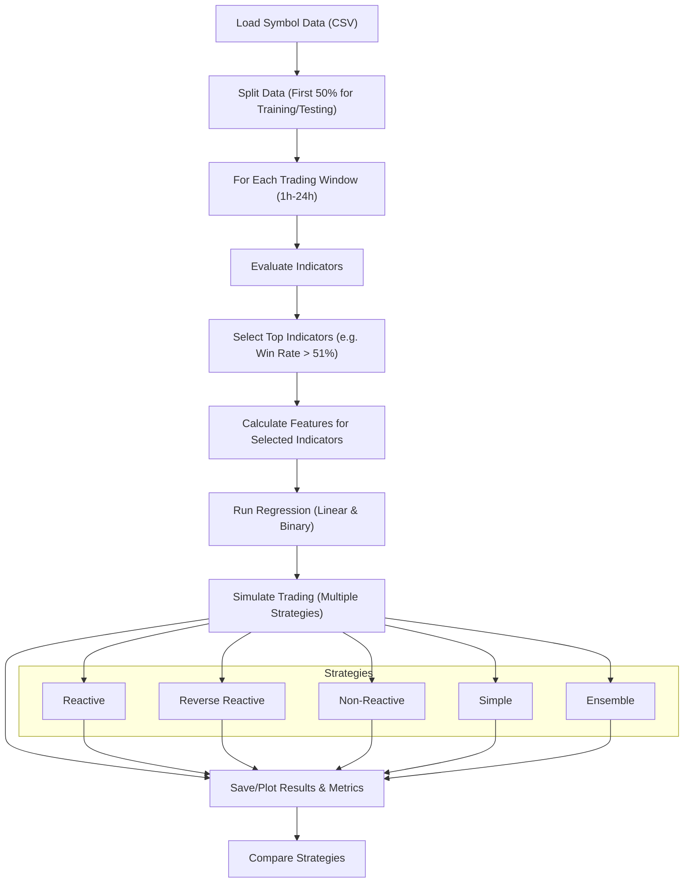

# Trading Pipeline Overview

This project implements a robust, modular pipeline for evaluating trading indicators and simulating trading strategies on cryptocurrency data. The workflow is designed for flexibility, extensibility, and clear comparison of different trading approaches.

## Pipeline Diagram

## Step-by-Step Description

1. **Load Symbol Data (CSV)**
   - Loads historical price and volume data for each symbol (e.g., BTC, ETH) from CSV files.

2. **Split Data (First 50% for Training/Testing)**
   - Uses the first half of the data for indicator evaluation and backtesting, ensuring no lookahead bias.

3. **For Each Trading Window (1h-24h)**
   - The pipeline loops over different holding periods (1 hour to 24 hours) to evaluate performance across timeframes.

4. **Evaluate Indicators**
   - Computes a wide range of technical indicators for each window.
   - Calculates win rate and information coefficient (IC) for each indicator.

5. **Select Top Indicators (Win Rate > 50%)**
   - Filters indicators to keep only those with a win rate above 50% for the current window.

6. **Calculate Features for Selected Indicators**
   - Computes the values of the selected indicators and adds them as features for modeling.

7. **Run Regression (Linear & Binary)**
   - Fits both linear regression (for returns) and logistic regression (for direction) models using the selected features.

8. **Simulate Trading (Multiple Strategies)**
   - Runs trading simulations using several capital management strategies (see below).

9. **Save/Plot Results & Metrics**
   - Saves results, metrics, and plots for each strategy and window.

10. **Compare Strategies**
    - Allows for easy comparison of performance across all strategies and windows.

## Strategies Explained

- **Reactive**: Adjusts position size based on current capital. More aggressive when winning, more defensive when losing.
- **Reverse Reactive (Martingale)**: The opposite of reactive. More aggressive when losing, more defensive when winning.
- **Non-Reactive**: Always uses the full capital for each trade, regardless of performance.
- **Simple**: Bets half the capital on a long position if the model predicts a rise, or half on a short if it predicts a fall.
- **Ensemble**: Only trades when both linear and binary models agree on direction, using the reactive capital management approach.

## Metrics
- **Total Return**: Net profit or loss over the simulation period.
- **Hit Rate**: Percentage of trades that were profitable.
- **Sharpe Ratio**: Risk-adjusted return.
- **IC (Spearman)**: Information coefficient, a measure of predictive power.
- **Number of Trades**: How many trades were executed.

## Usage
- Adjust parameters and strategies in `main2.py` to experiment with different approaches.
- Results and plots are saved in the `images/` directory for each run.

---

**This pipeline is designed for research and experimentation. You can easily add new indicators, strategies, or metrics to extend its capabilities!** 