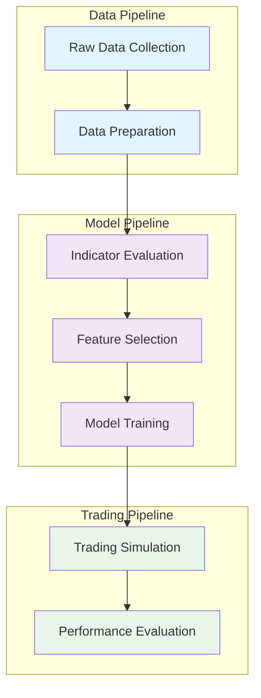

# Crypto Trading System: Pipeline & Strategies

## Project Structure & Pipeline Breakdown

**Key Python Files:**

- `main1.py` — Main pipeline for indicator evaluation, feature selection, and model training/testing.
- `regression.py` — Model training utilities: linear, binary, polynomial, quantile regression, majority vote, and ensemble models.
- `trading.py` — Trading simulation functions for all model types and strategies.
- `simulate_linear_model.py` — Batch testing of linear and binary models across symbols and trading windows.
- `simulate_poly_majority.py` — Batch testing of polynomial and majority vote models across symbols and trading windows.
- `functions.py` — Utility functions for data collection, indicator testing, IC, win rate, Sharpe, etc.
- `indicators.py` — Technical indicator calculation functions.
- `archive/` — Historical scripts, backtests, and experiments.

**Typical Workflow:**

1. **Data Preparation**
   - Raw data is collected and saved as CSVs (e.g., `BTC_spot_full.csv`).
   - Data is split: the first half for model/indicator selection, the second half for final out-of-sample testing.

2. **Indicator Evaluation**
   - For each symbol and trading window, all indicators are evaluated.
   - Metrics computed: win rate, weighted win rate (by class balance), Information Coefficient (IC), Sharpe ratio, R², etc.
   - Results are saved (e.g., `indicator_results_BTC.csv`).

3. **Indicator Selection**
   - Best indicators are selected based on win rate, weighted win rate, IC, and other metrics.
   - Only top indicators are used as features for model building.

4. **Model Building**
   - Models are trained using selected indicators and price-related features.
   - Supported models:
     - **Linear Regression**
     - **Binary Classification (Logistic Regression)**
     - **Polynomial Regression**
     - **Majority Vote Model** (ensemble of indicator signals + binary regression)
     - **Quantile Regression**
     - **Linear+Binary Ensemble** (trade only when both agree)

5. **Strategy Simulation**
   - For each model, multiple trading strategies are tested:
     - **Reactive**: Adaptive capital assignment based on performance. Uses min-max normalization for signal scaling.
     - **Reverse Reactive**: Inverse of reactive. Also uses adaptive capital assignment and min-max normalization.
     - **Simple**: Fixed capital for long/short trades. Uses raw or normalized signals.
     - **Quartile**: Position size based on signal quartiles (larger positions for extreme signals). Uses min-max normalization.
     - **Aggressive**: All-in long/short based on signal direction. Uses raw or normalized signals.
     - **Proba Ensemble**: (For ensemble models) Position size is based on the probability output of the binary model, allowing for probability-weighted trades.
   - **Majority Vote Model**: Abstains (no trade) in case of a tie among indicator and model votes, making it robust to outliers.
   - Some strategies use z-clipping or min-max normalization for signal scaling, as appropriate for the model and signal distribution.
   - Results are plotted and saved, including buy-and-hold benchmarks.

6. **Final Testing**
   - The best models/strategies are evaluated on the second half of the dataset (never seen during training/selection).

---

## Model & Strategy Overview

| Model Type         | Description                                                      |
|--------------------|------------------------------------------------------------------|
| Linear Regression  | Standard regression on selected features                         |
| Binary Regression  | Logistic regression for up/down prediction                       |
| Polynomial         | Linear regression on polynomial-expanded features                |
| Majority Vote      | Ensemble: binary regression + indicator votes                    |
| Quantile Regression| Predicts conditional quantiles of return                         |
| Linear+Binary      | Trades only when both linear and binary agree                    |

**Strategy Details:**
- **Reactive/Reverse Reactive:** Use adaptive capital assignment, increasing or decreasing position size based on recent performance. Signals are min-max normalized to [-1, 1].
- **Simple:** Trades a fixed fraction of capital long or short based on the sign of the model signal (raw or normalized).
- **Quartile:** Position size is determined by which quartile the signal falls into; extreme signals (top/bottom quartile) get larger positions. Uses min-max normalization.
- **Aggressive:** Allocates all capital long or short based on the sign of the model signal (raw or normalized).
- **Proba Ensemble:** (Ensemble models only) Position size is proportional to the probability output of the binary model, allowing for probability-weighted trades.
- **Majority Vote:** Combines binary regression and indicator signals; abstains from trading in case of a tie, which increases robustness to outliers.
- **Signal Scaling:** Some strategies use z-clipping or min-max normalization to ensure signals are on a comparable scale for position sizing.

---

## How the Process Works

1. **Dataset Split:**
   - The dataset is divided in two: the first half is used for indicator/model selection and cross-validation; the second half is reserved for final out-of-sample testing.

2. **Indicator Testing:**
   - For each trading window, all indicators are evaluated for win rate, weighted win rate (accounts for class imbalance), IC, Sharpe, etc.
   - Top indicators are selected for each window.

3. **Model Training:**
   - Models are trained using the selected indicators and price features.
   - Each model is validated using walk-forward or cross-validation.

4. **Strategy Simulation:**
   - Each model is tested with multiple capital management strategies.
   - Simulations are run and results are plotted (including buy-and-hold for comparison).

5. **Final Evaluation:**
   - The best models/strategies are tested on the second half of the data for true out-of-sample performance.

---

## Future Development Roadmap

### Phase 1: Advanced Portfolio Management
- **Multi-Asset Portfolio Optimization**
  - Implement Markowitz portfolio theory for optimal asset allocation
  - Risk parity strategies for balanced risk exposure
  - Dynamic rebalancing based on market conditions
  - Correlation-based position sizing across assets

- **Kelly Criterion Implementation**
  - Kelly's formula for optimal position sizing: f* = (bp - q) / b
  - Dynamic Kelly based on rolling win rates and odds
  - Fractional Kelly for risk management
  - Kelly-based portfolio allocation across multiple strategies

### Phase 2: Advanced Trading Strategies
- **Pair Trading & Mean Reversion**
  - Cointegration analysis for pair selection
  - Statistical arbitrage strategies
  - Mean reversion with volatility scaling
  - Spread-based position sizing

- **Momentum & Trend Following**
  - Multi-timeframe momentum strategies
  - Trend strength indicators
  - Breakout detection algorithms
  - Volatility-adjusted momentum signals

### Phase 3: Machine Learning Enhancements
- **Deep Learning Models**
  - LSTM/GRU for sequence modeling
  - Transformer architectures for market prediction
  - Attention mechanisms for feature importance
  - Ensemble of neural networks

- **Reinforcement Learning**
  - Q-learning for optimal trading actions
  - Policy gradient methods for strategy optimization
  - Multi-agent systems for portfolio management
  - Risk-aware RL algorithms

### Phase 4: Risk Management & Analytics
- **Advanced Risk Metrics**
  - Value at Risk (VaR) and Conditional VaR
  - Maximum drawdown analysis
  - Stress testing and scenario analysis
  - Real-time risk monitoring

- **Market Regime Detection**
  - Hidden Markov Models for regime identification
  - Regime-dependent strategy selection
  - Adaptive parameter tuning
  - Regime transition probabilities

### Phase 5: Production & Deployment
- **Real-time Trading System**
  - Low-latency execution engine
  - Real-time data feeds and processing
  - Automated order management
  - Performance monitoring dashboard

- **Backtesting Framework**
  - Event-driven backtesting engine
  - Transaction cost modeling
  - Slippage and market impact simulation
  - Realistic execution modeling

---

## Summary

This project provides a robust, modular pipeline for indicator evaluation, model building, and trading simulation across multiple strategies and model types. The system is designed for extensibility and rigorous out-of-sample testing, with a focus on both predictive power and practical trading performance.

The future roadmap includes advanced portfolio management techniques like Kelly's criterion and multi-asset optimization, along with sophisticated machine learning approaches and comprehensive risk management systems. 